# Chapter 02 Notes :notebook:

## Key Concepts :brain:

### Constants
Numbers, strings, letters which value does not change.
- **Numeric Constants** - are numbers written directly in a program. Python uses them exactly as they appear and treats them as fixed values.

- **String Constants** - are pieces of text written inside quotation marks; can use either single `'` or double `"` quotation marks.
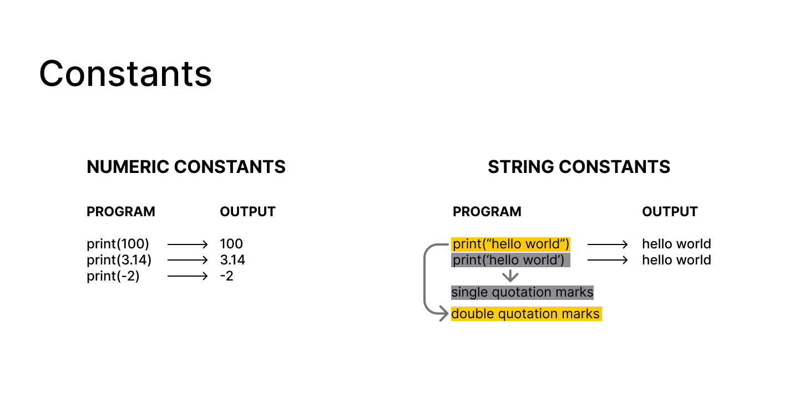

### Reserved Words
Part of the language syntax that can't be used as variable names.

### Variables
Variable names allow programmers to store and retrieve data using a name they choose. Variables are created and assigned values using an assignment statement `=`.

The value stored in a variable can be accessed later in the program and can be changed by assigning a new value.

*Example:*

        x = 2

### Variable Name Rules
- Variable names can start with a letter or an underscore `_`.
- They can contain letters, numbers, and underscores.
- Variable names are case-sensitive, so **age**, **Age**, and **AGE** are treated as different variables.
- Although variable names can begin with an underscore, names starting with `_` are often used by Python or by programmers to indicate special, internal, or non-public variables. Beginners typically avoid using leading underscores unless there is a specific reason to do so.

### Mnemonic Variable Names
Mnemonic variable names are descriptive names that make code easier to read, understand, and remember. They act as memory aids for programmers by giving clues about the data being stored.

Python does not understand the meaning or purpose of the name itself, it simply uses the variable as a container for data. The meaning comes from the name chosen by the programmer.
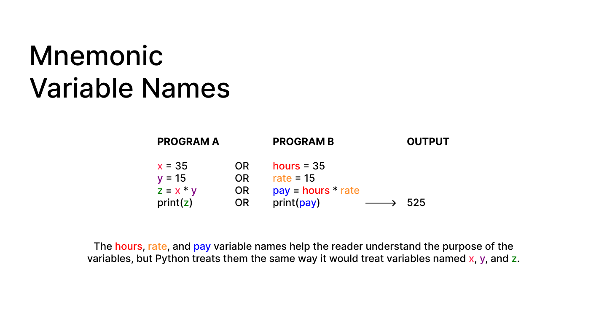

### Assignment Statements
In an assignment statement, the expression is on the right side and the variable receiving the value is on the left side. The value of the expression is stored in the variable.
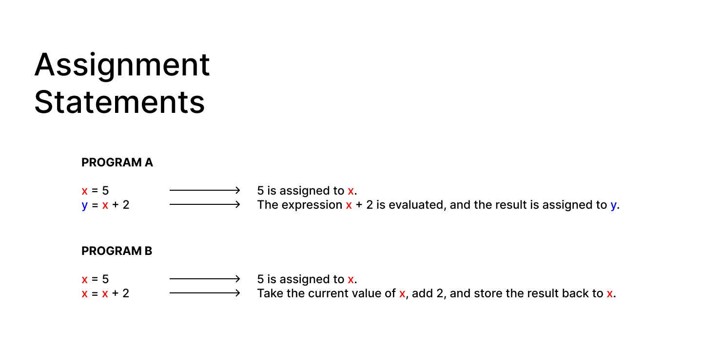

### Numeric Expressions
These are combinations of numbers, variables, and operators that Python evaluates to produce a numeric result. Since mathematical symbols such as `×` and `÷` are not readily available on a standard keyboard, Python uses special symbols to represent mathematical operations.
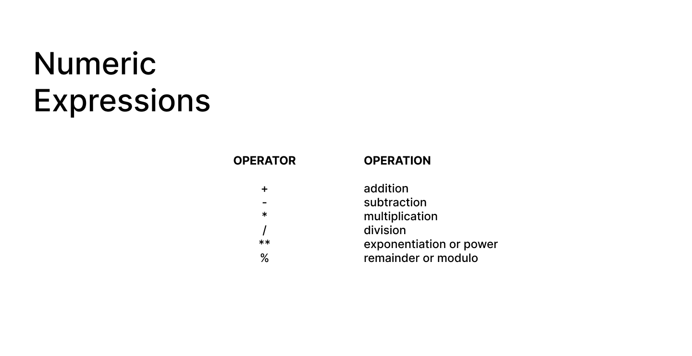

- **Note:** The modulo operator `%` returns the remainder after division.

### Order of Evaluation
When an expression contains multiple operators, Python follows a set of rules to determine which operations to perform first. This ensures that expressions are evaluated consistently and produce the correct result.
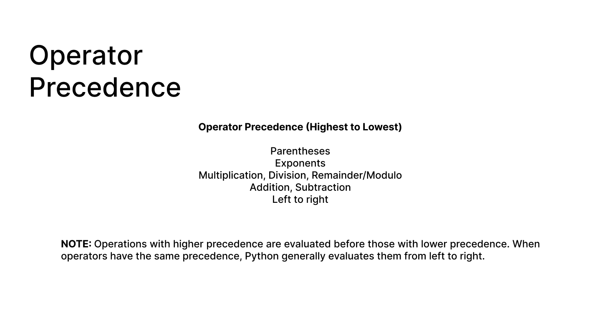

- Python evaluates expressions based on operator precedence and left-to-right rules.
- Use parentheses `()` to make the order of operations clear and avoid confusion.
- Keep mathematical expressions simple so they are easier to read and understand.
- Break long or complex expressions into smaller steps to improve clarity and reduce errors.

### Types of Data
In Python, values such as variables, literals, and constants have a data type. Python can distinguish between different types, such as integers (numbers) and strings (text).

The meaning of some operators depends on the data type being used. For example, the + operator performs addition when used with numbers, but it performs concatenation (joining) when used with strings.
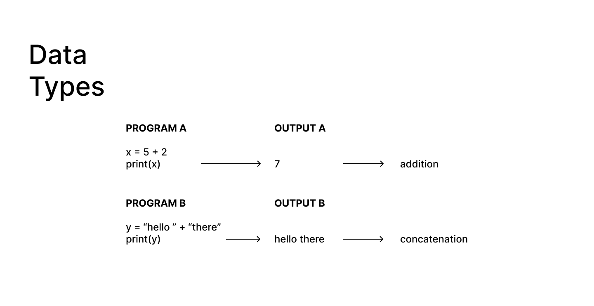

### Type Errors
A TypeError occurs when an operation is applied to values of incompatible types. Python keeps track of the type of each value and rejects operations that do not make sense for those types.

Python knows the type of each value. When an operation is not valid for those types, it raises a TypeError. The `type()` function can be used to inspect a value's type.
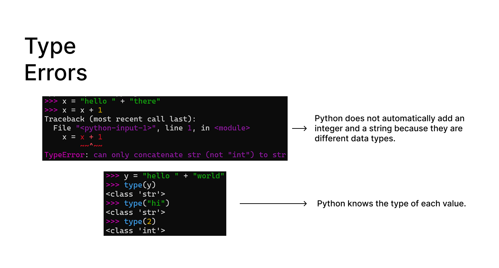

### Several Types of Numbers
- **Integers** - whole numbers without a decimal point (e.g., 1, 2, 34, 1000, -7)
- **Floating Point Numbers** - numbers that contain a decimal point (e.g., 3.14, 5.25, 0.99, -5.41)

Constants can be represented as either integers or floating point numbers, depending on whether they contain a decimal point.

### Type Conversions
When an integer and a floating point number are used in the same expression, Python automatically converts the integer to a floating point number before performing the calculation.

Type conversion can also be performed explicitly using functions such as `int()` and `float()`.
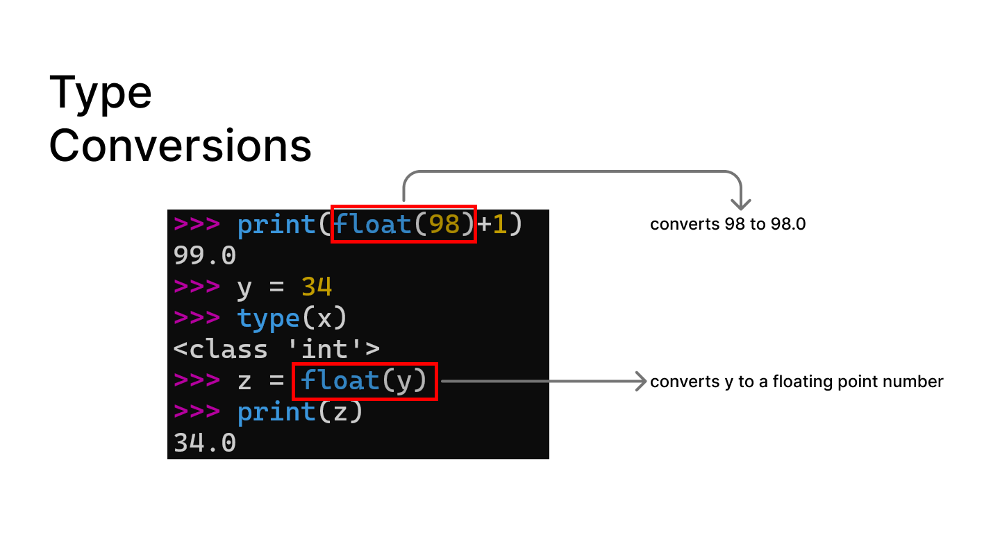

### Integer Division
In Python, division using `/` always produces a floating point result, even if both numbers are integers.
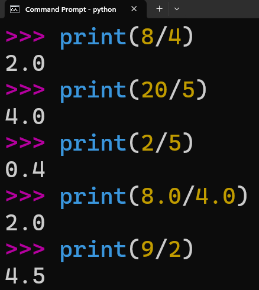

### String Conversions
The `int()` and `float()` functions can be used to convert strings containing numeric characters into integers or floating point numbers.

An error occurs if the string cannot be interpreted as a valid number.
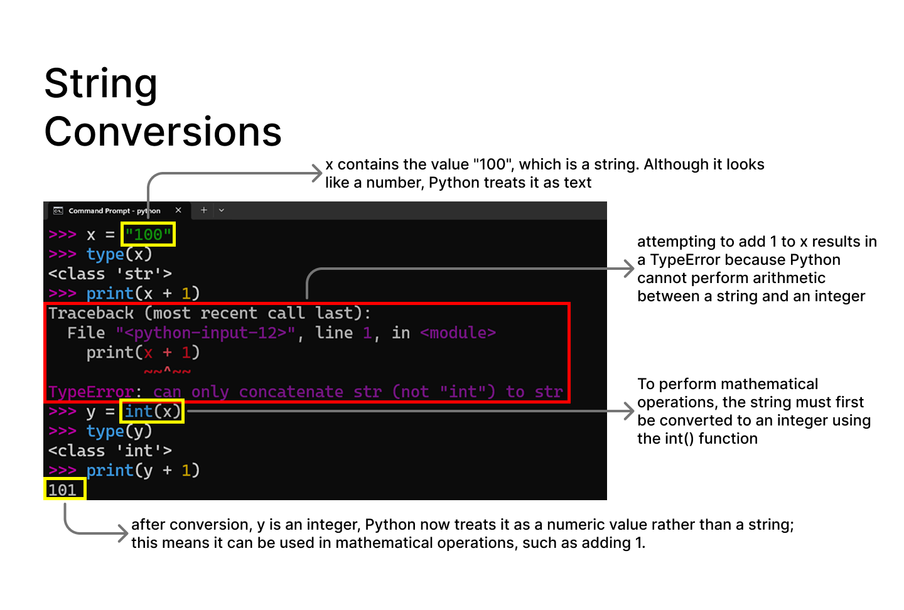

### User Input
Python can be instructed to pause and wait for input from the user using the `input()` function. The value entered by the user is returned as a string.
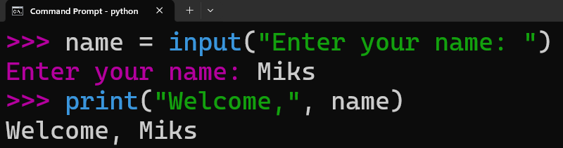

### Converting User Input
Since the `input()` function returns a string, user input must be converted to a numeric type before it can be used in mathematical calculations. This can be done using type conversion functions such as `int()` and `float()`.
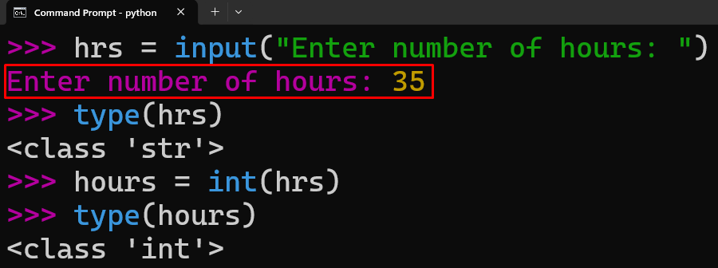

### Comments in Python
- Anything after `#` in a line is a comment in Python.
- Comments are used to explain code, describe what it does, or add information like the author or purpose.
- They can also be used to temporarily disable a line of code.
- Comments are ignored by Python and are only for humans to read.
- They help improve code readability and traceability.

### Important Learnings :bulb:
- The `input()` function always returns a string, even if the user enters a number.
- Values must be converted using `int()` or `float()` before performing mathematical operations.
- Python performs automatic type conversion in mixed expressions (e.g., integer + float).
- The `/` operator always returns a floating point result.
- The `%` operator returns the remainder of a division.
- Operator precedence determines the order in which expressions are evaluated.
- Parentheses `()` can be used to control the order of evaluation.
- Data types affect how operators behave (e.g., + means addition for numbers and concatenation for strings).
- Type errors occur when operations are applied to incompatible data types.
- The `type()` function is used to inspect the type of a value.
- I applied these concepts by building a temperature converter that converts Celsius into Kelvin and Fahrenheit.

### Observations :mag:
- At first, I tried running Python code in VS Code and saw output issues and a "read-only editor" error, which made it confusing.
- I later learned that Python scripts should be executed in the terminal, which resolved the issue.
- Using the terminal (Command Prompt / VS Code terminal) felt more aligned with how real Python programs are executed.
- I practiced navigating directories using command-line commands such as `cd` and `dir`, as introduced in the course exercises.
- Running scripts through the terminal helped me better understand how files are executed step by step instead of relying on the editor output panel.
- Small changes in code (like data types or operators) significantly affect program behavior, which helped reinforce the importance of type awareness.
- I realized that writing notes after experimenting with code helps reinforce understanding more than just reading examples.