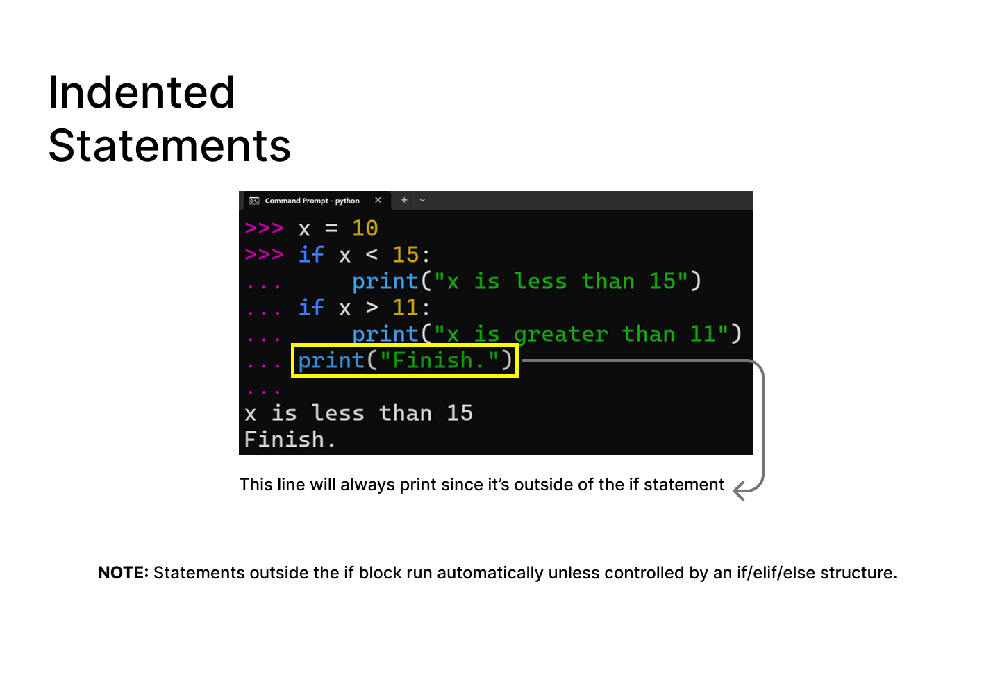
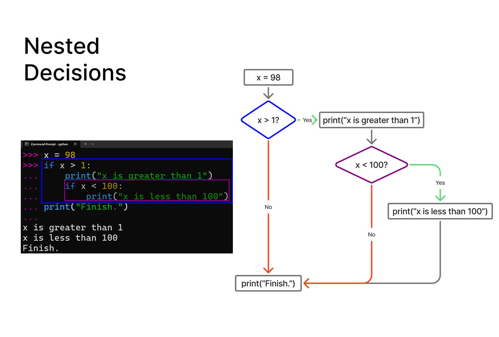
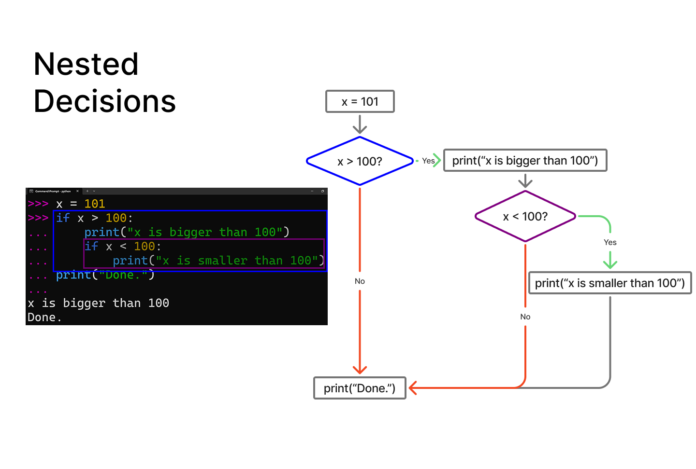
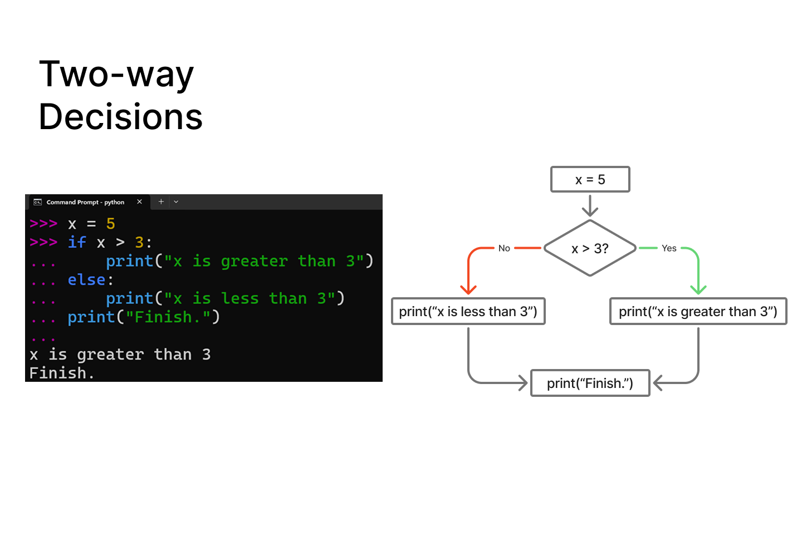
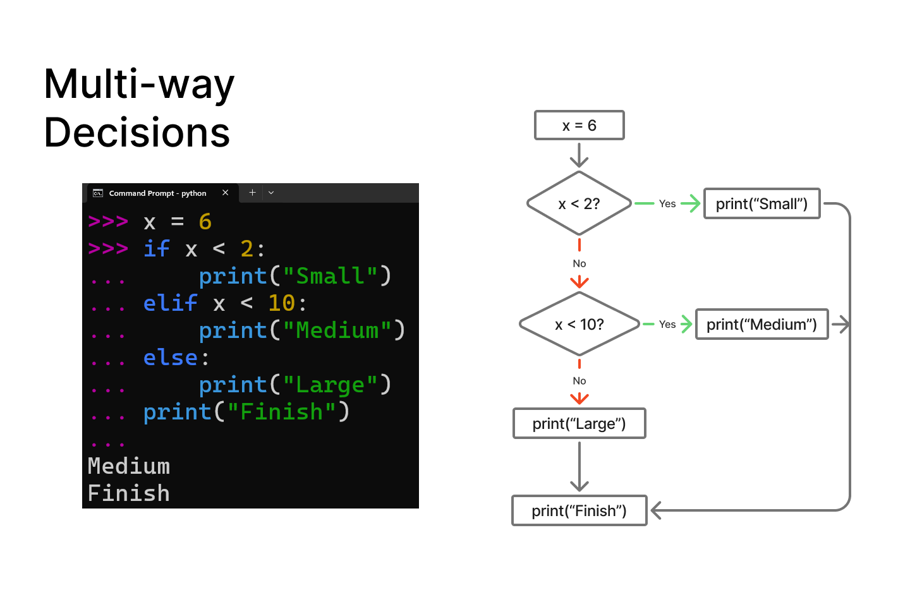

# Chapter 03 Notes :notebook:

## Key Concepts :brain:

### Conditionals
Conditionals are statements that allow Python to make decisions based on conditions that evaluate to either `True` or `False`.

They control which block of code is executed using statements like `if`, `elif`, `else`.
- `if` - checks a condition
- `elif` - checks another condition if the first one is false
- `else` - runs if all conditions are false

### Comparison Operators
Comparison operators are used to compare two values and determine whether a condition is `True` or `False`.

They are commonly used in statements like `if`, `elif`, and `else`.

It is important not to confuse:
- `=` which is the **assignment operator** (to store values in variables)
- `==` which is the **equality operator** (used to compare values)

Boolean expressions are conditions that evaluate to either `True` or `False` *(Yes or No results)*. They are often formed using comparison operators.

**Note:** Comparison operators don't change variable values.

### Nested Decisions
Nested decisions occur when one `if` statement is placed inside another `if` statement. The inner condition is only evaluated if the outer condition is `True`.

### Two-way Decisions
Two-way decisions are conditional statements that choose between two possible paths using `if` and `else`.

Only one of the two paths will execute depending on whether the condition is `True` or `False`.

### Multi-way Decisions
Multi-way decisions use `if`, `elif`, and `else` to choose between multiple possible paths. Multiple `elif` statements can be used to represent different conditions.

Python evaluates the conditions from **top to bottom**. The order of `elif` statements matters because Python checks each condition in sequence.

If a condition is `True`, its block executes and Python skips all remaining `elif` and `else` blocks inside the same `if`/`elif`/`else` chain. If a condition is False, Python continues checking the next condition.

Once a condition evaluates to `True`, the decision chain ends and Python moves on to the next part of the program.

Only one branch of the decision structure will execute.

### Try / Except Structure
The `try` and `except` structure is used to handle errors in Python.

Code that might cause an error is placed inside the `try` block. If an error occurs, Python stops executing the `try` block and runs the code inside the `except` block instead. This prevents the program from crashing.

If no error occurs, the `except` block is skipped.

**Examples:**
- **Without try/except:**
[No error handling version](../exercises/no-tryexcept.py)

- **With try/except:**
[With error handling version](../exercises/try-except.py)

**Note:** Keep the `try` block ***minimal*** by only including code that may cause an error. If an error occurs, Python stops executing the rest of the `try` block and moves to the `except` block. It does not return to the `try` block afterward.

- `try` - run risky code
- `except` - run if the risky code breaks

### Important Learnings :bulb:
- Conditional statements allow programs to make decisions using `True` and `False` conditions
- `if`, `elif`, and `else` form a single decision chain where only one branch executes
- Nested `if` statements allow decisions within decisions, depending on previous conditions
- Comparison operators are used to evaluate conditions, not assign values
- Indentation defines code blocks and determines which statements belong to a condition
- Multi-way decisions depend on the order of conditions, evaluated from top to bottom
- `try` and `except` handle runtime errors and prevent program crashes
- Once Python enters an `except` block, it does not return to the try block

### Observations :mag:
- Writing multiple versions of the same logic (with and without `try`/`except`) helped highlight how error handling changes program behavior
- Using different inputs showed how conditional flow changes depending on values
- Independent `if` statements can produce multiple outputs, while `elif` chains stop at the first match
- Indentation directly affects program structure and execution grouping
- Small changes in condition order can completely change program output in multi-way decisions
- Debugging became easier when I started tracing execution step-by-step instead of guessing outcomes
- Running small test cases helped reinforce how Python evaluates conditions sequentially