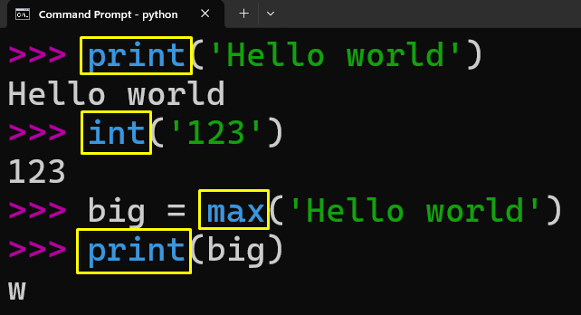
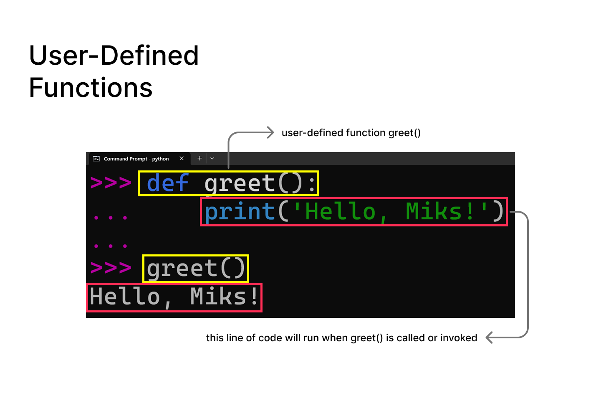
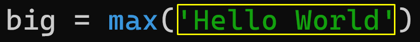
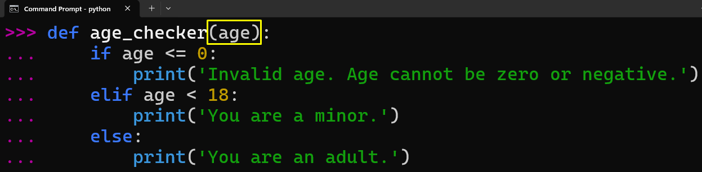
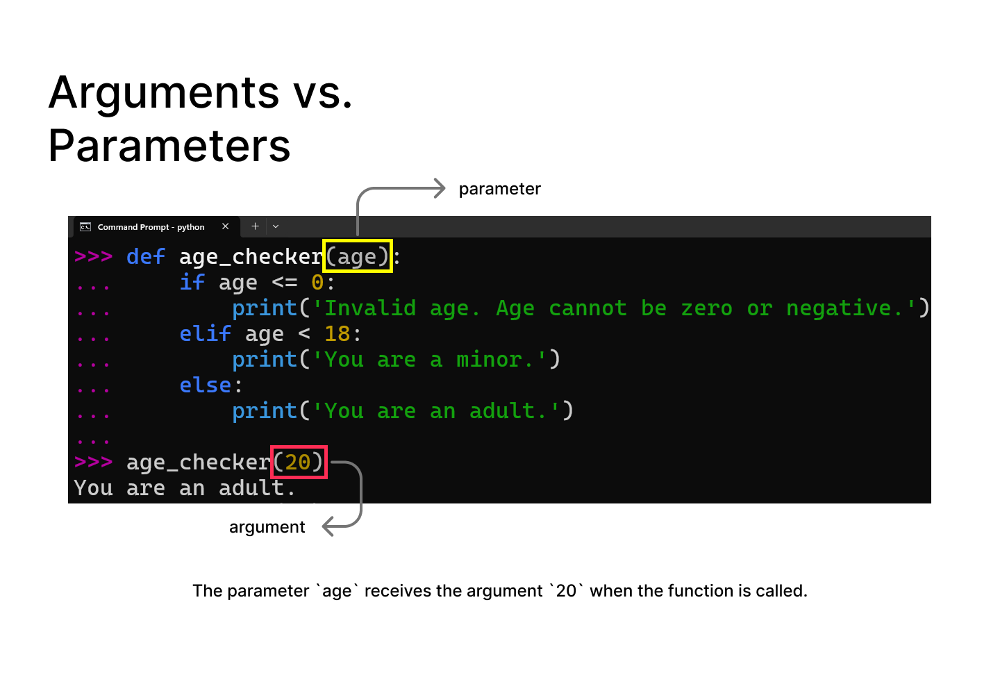
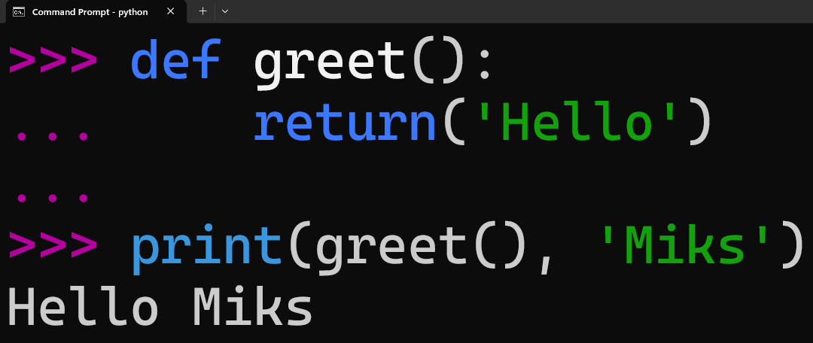
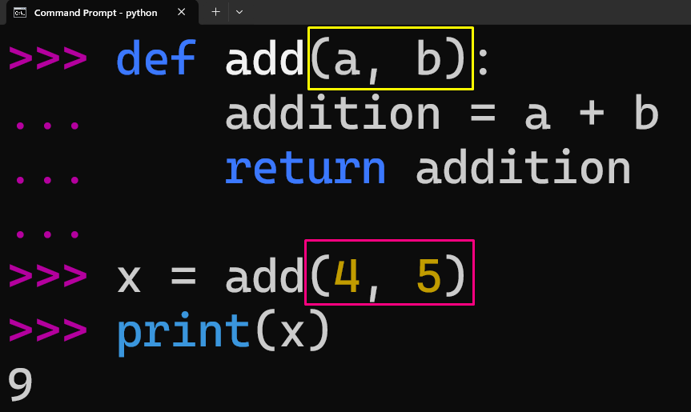
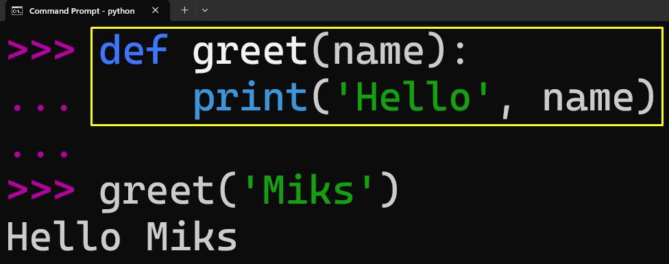

# Chapter 04 Notes :notebook:

## Key Concepts :brain:

### Functions
Functions are reusable blocks of code designed to perform a specific task. They help avoid repeating code and make programs easier to organize and maintain.

There are two types of functions:

- **Built-in Functions** that are provided as part of Python

- **User-Defined Functions** that are created by programmers to perform specific tasks. They allow code to be reused and organized into smaller, manageable parts.

A function is created using the `def` keyword, followed by the function name and parameters.

### Arguments
Arguments are values passed into a function when it is called. They provide the function with the information it needs to perform a specific task.

Arguments are placed inside the parentheses after the function name when calling the function.

**Example:** The string `'Hello World'` is the argument passed into the `max()` function.

### Parameters
Parameters are variables listed in a function definition. They act as placeholders that receive arguments when the function is called.

Parameters allow the code inside a function to access and use the values provided during a function call.

**Example:** The `age` is used as the parameter.

### Arguments vs. Parameters
Parameters and arguments are related, but they refer to different parts of a function.

- **Parameters** are variables listed in a function definition. They act as placeholders that receive values.
- **Arguments** are the actual values passed into a function when it is called.

### Return Values
A return value is the result that a function sends back after it finishes its task. The `return` keyword is used to send a value back from a function.

The returned value can be stored in a variable or used in another expression.

- A fruitful function is one that produces a result or a return value.
- The `return` statement ends the function's execution and sends back the *result* of the function.

### Multiple Parameters
A function can have multiple parameters defined in its function definition. When calling the function, provide the same number of arguments and match them in the correct order.

The values of the `arguments` are assigned to the corresponding `parameters`.

***Note:*** The order of arguments matters because each argument is assigned to its matching parameter position.

### Void (Non-fruitful) Functions
A function is considered void or non-fruitful when it does not return a value.

Void functions perform an action, such as displaying output, but they do not send a result back to the code using the `return` keyword.

In this example, the function displays a message but does not return a value.

### To Function or Not to Function

Functions help organize code, reduce repetition, and make programs easier to maintain. However, functions should be created when they improve the structure and readability of a program.

- Organize code into logical sections that represent a complete thought, then give that section a meaningful name.
- Avoid repeating code. Write the logic once and reuse it through a function.
- Create reusable functions for common tasks that are performed frequently.
- Avoid creating functions too early. Small pieces of code do not always need to become functions if they make the program more complicated.

### Important Learnings :bulb:
- Functions allow code to be organized into smaller, reusable sections that perform specific tasks.
- Parameters act as placeholders that allow functions to work with different values, while arguments are the actual values passed when calling a function.
- The order of arguments matters because values are assigned to parameters based on their position.
- Return values allow functions to send results back to the code that called them, making the result reusable in other parts of the program.
- Fruitful functions return a value, while void (non-fruitful) functions perform an action without returning a useful result.
- Functions should be created when they improve code organization, reduce repetition, or make code easier to maintain.

### Observations :mag:
- Going through the pay calculator exercise helped me understand how functions can receive inputs through parameters and return calculated results.
- The difference between arguments and parameters was initially confusing, but researching the topic and creating my own examples helped me understand how parameters act as placeholders and arguments provide the actual values.
- Building a simple age calculator helped me practice combining functions with conditional statements and input validation.
- Adding error handling using `try` and `except` from previous lessons helped solidify my understanding of writing programs that handle unexpected user input more gracefully.
- Experimenting with small projects such as a simple calculator and age calculator helped me understand how functions can be reused in different situations.
- I noticed that functions make programs easier to read because each function can focus on one specific task.
- Writing small experiments beyond the chapter exercises helped me understand the purpose of functions instead of only memorizing their syntax.