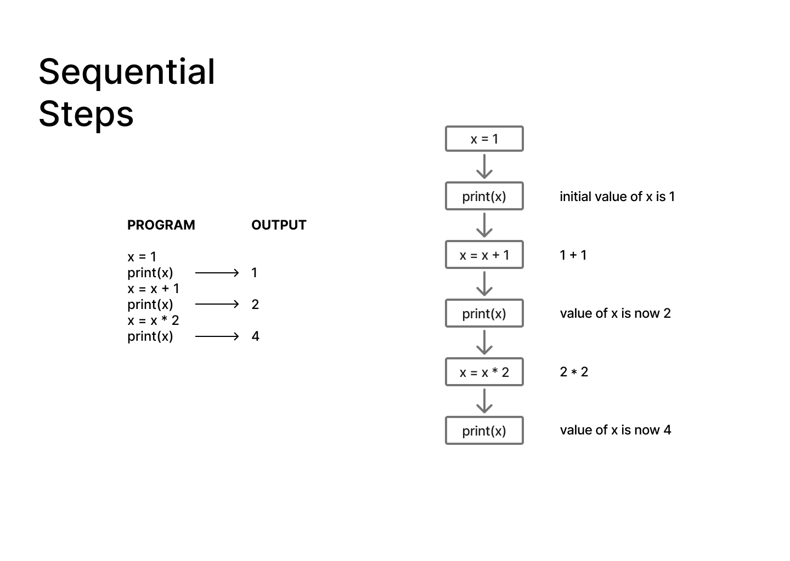
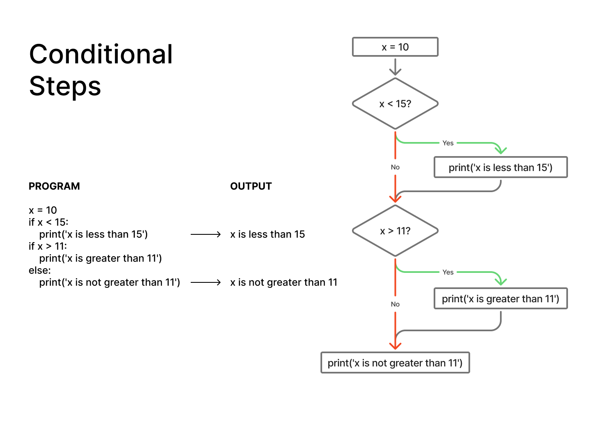
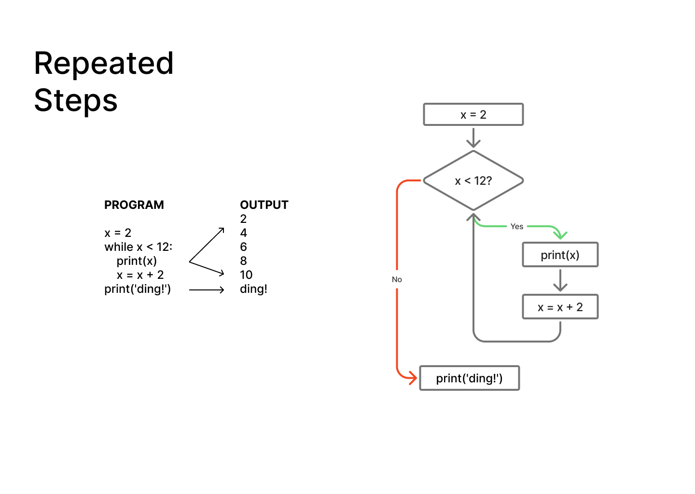

# Chapter 01 Notes :notebook:

## Key Concepts :brain:

### Reserved Words
There are special keywords in Python that have predefined meanings. They cannot be used as variable names because they are part of the language syntax.

### Simple Assignment Statements
Variables are created using the assignment operator (=). The value on the right is stored in the variable on the left.

*Example:*

    x = 10

### Python Scripts
Since programs are usually long, it is better to write a sequence of statements in a file using a text editor and then tell Python to execute the file.

### Program Steps or Program Flow
A program is a sequence of steps executed in order. Some steps are sequential, conditional, or repeated depending on the logic.

### Important Learnings :bulb:
- Python executes instructions one line at a time, from top to bottom.
- Variables act as containers that store values which can be used later in the program.
- A Python script is simply a file containing Python code that can be executed by the interpreter.
- Program flow can be represented visually using flowcharts, making it easier to understand how a program follows a sequence of steps.
- Small changes in values, operators, or statements can produce different outputs while keeping the overall structure of the program the same.
- Indentation affects how Python interprets code and determines which statements belong to a specific block.

### Observations :mag:
- Changing the values used in examples helped me better understand how Python processes instructions.
- Modifying arithmetic operations (such as addition, subtraction, multiplication, and division) allowed me to observe how different operators affect the output.
- While experimenting with a script, I noticed that indentation changed the behavior of the program. A statement inside an indented block did not execute the way I expected until I adjusted the structure of the code.
- Running small examples and immediately seeing the output made it easier to connect the code with the program flow concepts introduced in the chapter.
- Flowcharts helped me visualize how a program moves from one step to the next before seeing the same logic represented in code.